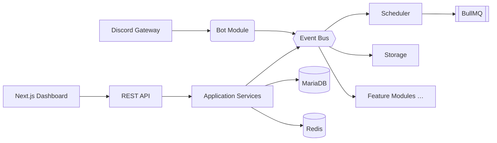

<h1 align="center">👻 Ghost Bot</h1>

<p align="center">
  <strong>An enterprise-grade, modular Discord bot platform — built to last years, not weekends.</strong>
</p>

<p align="center">
  <a href="https://github.com/zaraaraz/armstrong_bot/actions/workflows/ci.yml"></a>
  <a href="https://github.com/zaraaraz/armstrong_bot/actions/workflows/deploy.yml"></a>
  <a href="https://github.com/zaraaraz/armstrong_bot/actions/workflows/codeql.yml"></a>
  
  
</p>

---

Most Discord bots start as a single `index.js` and grow into a 15,000-line file everyone is afraid to touch. **Ghost Bot is the opposite bet**: a platform where every capability is an isolated, spec-driven module on top of a shared core — so the bot can grow for years without collapsing under its own weight.

It is **multi-guild** by design, **event-driven** at its core, and ships with a **web dashboard**, a **REST API**, and a **fully automated deploy pipeline**. Nothing here is scaffolding: every merged module is implemented, tested, documented and running in production.

## ✨ What's inside

| | |
|---|---|
| 🤖 **Discord gateway** | Necord + discord.js — slash commands, gateway events bridged onto the internal event bus |
| 🖥️ **Web dashboard** | Next.js app with Discord OAuth login, guild selector, module panels, API-key & backup management, live log stream over WebSockets |
| 🔌 **REST API** | Versioned (`/api/v1`), Swagger-documented, JWT + API-key + session auth, rate-limited |
| 🧩 **Plugin system** | Manifest-based plugins with lifecycle hooks (install/enable/disable) that extend the bot without touching core |
| 🌍 **i18n** | Full translation engine (PT 🇵🇹 primary, EN 🇬🇧 secondary) — namespaces, ICU plurals, per-guild & per-user locale, DB-editable |
| 🛡️ **Permissions** | Claim-based with wildcards (`tickets.*`, `storage.delete`), groups, inheritance, Discord-role mapping |
| ⏰ **Scheduler** | Cron / delayed / recurring jobs over BullMQ with retries, DLQ, maintenance windows and a dashboard panel |
| 🗄️ **Storage** | Content-addressed blob store with dedupe, per-guild quotas, HMAC-signed downloads and swappable drivers (local → S3/R2/Backblaze) |
| 🔐 **Security layer** | Encrypted secrets at rest, Argon2id-hashed API keys, sliding-window rate limits, audit hooks, log redaction |

## 🏛️ Architecture

Clean Architecture + DDD-lite, enforced — not aspirational:

```
Controller / Slash Command      ← thin: validate, delegate, format
        │
Application Service             ← orchestration, quotas, events
        │
Domain Service                  ← pure logic, unit-tested in isolation
        │
Repository                      ← the ONLY layer that touches Prisma
        │
MariaDB / Redis / BullMQ
```

**Modules never import each other's internals.** They communicate through a strongly-typed **Event Bus** (`storage.object.stored`, `scheduler.job.completed`, …) or through a module's published public contract — nothing else. That single rule is what keeps 30+ planned modules from becoming a big ball of mud.



Every module follows the same blueprint — `domain/`, `application/`, `infrastructure/`, `api/`, `events/`, `observability/` — with a public `index.ts` barrel as its only importable surface. One module = one spec = one branch = one reviewed merge.

## 📐 Spec-driven development

The entire platform was designed **before** it was built: [`docs/`](docs/) holds ~20,000 lines of engineering specifications — one document per architectural concern and per module, each with public interfaces, Prisma schema, events, permissions, an ordered implementation plan and acceptance criteria.

```
docs/
├── 00-project.md          ← the contract every module obeys
├── architecture/          ← core, database, cache, i18n, permissions,
│                            events, plugins, API, dashboard, security, testing, CI/CD
├── modules/               ← one spec per module (19 of them)
├── development/           ← coding standards, branching, PRs, releases
└── roadmap.md             ← build order & status
```

## 🚦 Engineering discipline

- **TypeScript strict, zero `any`** — enforced by lint, not convention
- **220+ unit tests** plus integration & contract suites; coverage thresholds gate CI
- **Conventional Commits** → automated semantic releases & changelog
- **CI pipeline**: lint → typecheck → tests + coverage → migration-drift check → CodeQL → Docker build
- **Continuous deployment**: every push to `main` builds two images (bot + dashboard), publishes them to GHCR, and rolls the production stack forward — migrations first, health-gated restart after
- **Prisma migrations** are append-only and verified against the schema on every CI run

## 🗺️ Roadmap

| Phase | Scope | Status |
|---|---|---|
| 1 — Infrastructure | Core kernel, database, cache, CI/CD | ✅ |
| 2 — Core platform | i18n, permissions, event bus, security, plugins, testing | ✅ |
| 3 — API & Dashboard | REST API + visual dashboard (OAuth, panels, realtime) | ✅ |
| 4 — Foundational modules | Scheduler ✅ · Storage ✅ · Audit · Metrics · Notifications · Webhooks | 🔨 in progress |
| 5 — Feature modules | Moderation, tickets, levels, economy, giveaways, games, logs, utilities, analytics, backups, AI, FiveM | 📋 specified |
| 6 — Production hardening | Grafana dashboards, load testing, security review | 📋 planned |

Each Phase-5 module already has a complete spec in [`docs/modules/`](docs/modules/) — implementation follows the same blueprint proven by Scheduler and Storage.

## 🧰 Stack

`TypeScript` · `NestJS` · `Necord / discord.js` · `Prisma 7` · `MariaDB` · `Redis` · `BullMQ` · `Next.js 15` · `Zod` · `Vitest` · `Playwright` · `Docker` · `GitHub Actions` · `Prometheus / OpenTelemetry`

---

<p align="center"><sub>Built with a simple philosophy: <em>the goal is not to create another Discord bot — the goal is to build a platform.</em></sub></p>
